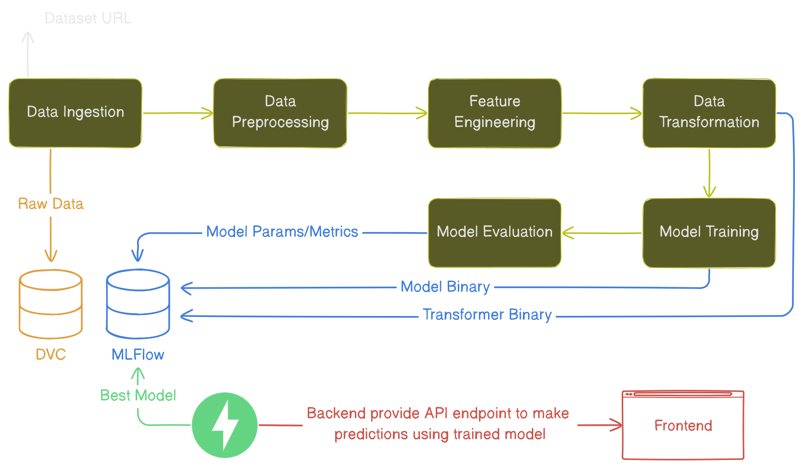
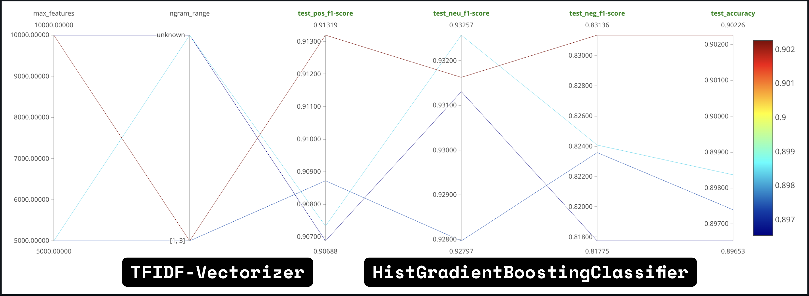

# YouTube Comment Sentiment

An end-to-end project to predict the sentiment of YouTube video comments using Machine Learning.

## Overview

This project focuses on building a sentiment analysis system for YouTube comments, complete with a FastAPI-based
inference endpoint and insights-providing API endpoints. The development process included robust experimentation,
tracking, and pipeline reproduction (using **MLFlow** and **DVC**).

### Key Features

- **Inference Endpoint:** Built using the FastAPI framework to classify sentiment of comments.
- **Insights Endpoints:** Additional APIs to provide analytics around comment sentiments.
- **Experiment Tracking:** Leveraged MLFlow for tracking experiments.
- **Pipeline Reproduction:** Utilized DVC (Data Version Control) for reproducibility.
- **Text Vectorization:** Used `TfidfVectorizer` for transforming text data into feature vectors.
- **Model Selection:** Experimented with various models and selected `HistGradientBoostingClassifier` as the
  best-performing classifier.

## Experimentation

The experimentation phase focused on optimizing hyperparameters for the `TfidfVectorizer` and
`HistGradientBoostingClassifier` model. Below is a screenshot showcasing how different hyperparameter combinations
impacted accuracy:

## Tech Stack

|                       Tech | Stack                                                                                                                                                                                                                                                                                                                                                                                                                            |
| -------------------------: | :------------------------------------------------------------------------------------------------------------------------------------------------------------------------------------------------------------------------------------------------------------------------------------------------------------------------------------------------------------------------------------------------------------------------------- |
|          **Data Handling** |                                                                                                                                                                                                                                                                                                                                                   |
|          **Backend Tools** |                                                                                                                                                                                           |
|       **Machine Learning** |                                                                                                                                                                                                                                                      |
| [**Frontend**](./frontend) |      |
|              **Dev Tools** |                            |

## :warning: Improvements

1. [x] Merge **both classifier model and vectorizer model** which reduce the complexity of loading them using using
       `MLFLOW_RUN_ID` in [`app.py`](backend/app.py).
2. [x] After completing previous step, load model using `MLFLOW_MODEL_URI` env instead of `MLFLOW_RUN_ID` env.
3. [ ] ⚠️ Try to use `MLproject` file to run ML Pipeline steps instead of [`dvc.yaml`](dvc.yaml) file. _(Only if
       Possible)_
   - [ ] Also investigate the use `dvc` here and try to know WHY, WHAT and HOW (part of it).
4. [ ] Know the clear distinction and involvement between the source code of ML Pipeline, Backend.

### Sentiment Model

- We can handle the imbalance(ness) of the dataset training _which might improve the model metrics_.
- We can also find more diverse data for this because **I have seen (while EDA) that it contains many political
  comments**.
  - [clapAI/MultiLingualSentiment](https://huggingface.co/datasets/clapAI/MultiLingualSentiment) from HuggingFace.
- We can use different text vectorization steps such as **Vectorization + PCA**.
- We can fine-tune a [BERT model](https://hf.co/arv-anshul/comment-sentiment-bert) and use it instead.

---

> \[!IMPORTANT\]
>
> Feel free to explore and contribute!
