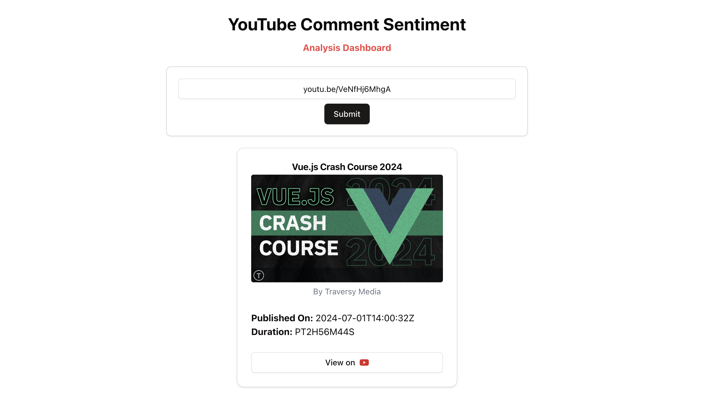

# frontend

> \[!NOTE\]
>
> Learning **Vue 3** as well as 👷 building this. As Vue is my frontend framework, this project may contains bugs and
> optimization vulnerabilities. But I am happy that I am learning new things continuously. 🫂

## Screenshots

Taken at **first commit** on **23 Dec 2024**.



## Project Setup

```sh
pnpm install
```

### Compile and Hot-Reload for Development

```sh
pnpm dev
```

### Compile and Minify for Production

```sh
pnpm build
```

## More to do!

- [ ] Show all video details beautifully.
  - [ ] Format `publishedAt` field.
  - [ ] Format `duration` field.
- [ ] Integrate endpoint to show pie chart. (🤖 try with dummy data).
